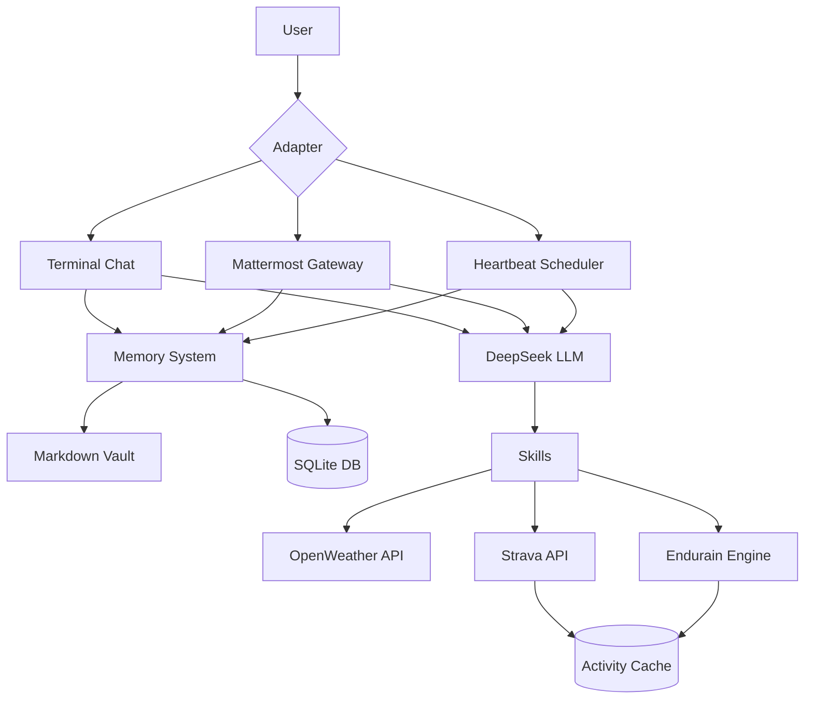

# cyCoachH – AI‑Powered Triathlon Coaching System

## Overview

cyCoachH is a personal AI coaching system designed to guide a user toward completing a full Ironman triathlon by Summer 2029. It integrates a local memory vault, real‑time weather and training data (Strava), a custom training‑metrics engine (Endurain), and multiple interaction channels (terminal chat, Mattermost) to deliver context‑aware coaching advice.

The system is built around a hybrid search memory that stores and retrieves structured knowledge (goals, daily logs, user preferences) and uses a DeepSeek LLM to generate responses that are grounded in that memory and enriched with current training status.

---

## System Architecture

### High‑Level Component Diagram



### Directory Structure

```
cyCoachH/
├── .env                           # Environment variables (API keys)
├── main.py                        # Entry point with mode dispatcher
├── adapters/                      # Communication interfaces
│   ├── terminal.py                # Interactive terminal chat
│   ├── mattermost_gateway.py      # Legacy Mattermost bot
│   └── mattermost_raw.py          # Robust WebSocket‑based Mattermost bot
├── heartbeat/
│   ├── beat.py                    # Periodic status check & alerting
│   └── services.py                # (Reserved for future services)
├── memory/                        # Knowledge base & vector search
│   ├── ingest.py                  # MemorySystem class (ingest, search)
│   ├── db.sqlite                  # SQLite store for embeddings & content
│   ├── endurain_cache.json        # Cached Strava activities
│   ├── vault/                     # Markdown knowledge vault
│   │   ├── SYSTEM.md              # Primary training objectives & constraints
│   │   ├── MEMORY.md              # Duplicate of SYSTEM (legacy)
│   │   ├── SOUL.md                # Agent personality & principles
│   │   ├── USER.md                # User demographics & habits
│   │   └── daily/                 # Daily interaction logs
│   │       └── 2026‑02‑17.md      # Example daily log
│   └── index/                     # (Reserved for vector index)
├── skills/                        # External data integrations
│   ├── weather.py                 # OpenWeather current conditions
│   ├── strava.py                  # Strava activity fetching
│   ├── endurain.py                # CTL/ATL/TSB training‑metrics calculator
│   ├── endurain_client.py         # (Reserved for Endurain service client)
│   └── registry.py                # (Placeholder for skill registry)
└── tools/
    └── get_strave_refresh.py      # OAuth helper for Strava token generation
```

---

## Core Modules

### 1. Memory System (`memory/ingest.py`)

**Purpose**: Persistent, searchable storage of the user’s training goals, daily logs, and system directives.

**Key Components**:
- **SQLite database** (`documents` table) stores file path, raw content, modification timestamp, and a FastEmbed vector embedding.
- **FastEmbed model** (`BAAI/bge‑small‑en‑v1.5`) generates 384‑dimensional embeddings for each document.
- **BM25** keyword‑search index built from the corpus for hybrid scoring.

**Workflow**:
- `ingest_vault()` scans the `vault/` directory for `.md` files, computes embeddings for new/changed files, and upserts them into SQLite.
- `search(query, limit)` performs a hybrid search: 70% vector cosine similarity + 30% BM25 keyword score.
- The memory is refreshed on‑the‑fly when the vault changes; the BM25 index is rebuilt after each ingestion.

**Vault Files**:
- `SYSTEM.md` – Definitive training plan, milestones, structural constraints (barefoot‑running mandate, strength‑training resources).
- `MEMORY.md` – Legacy copy of SYSTEM.md (kept for compatibility).
- `SOUL.md` – Agent identity and operational principles (stoicism, mindfulness, extreme discipline).
- `USER.md` – Static user information (age, location, lifestyle, habits).
- `daily/YYYY‑MM‑DD.md` – Each day’s log contains a timestamped record of chat interactions and system events, automatically appended by the adapters.

### 2. Skills

#### Weather (`skills/weather.py`)
- Fetches current conditions for Chur, Switzerland via OpenWeather API 2.5.
- Returns a formatted string (temperature, feels‑like, humidity, wind) used by the heartbeat and Mattermost adapters.

#### Strava (`skills/strava.py`)
- Uses OAuth refresh‑token flow to obtain an access token.
- `get_raw_activities(days=42)` retrieves the user’s activities for the given period.
- `get_training_status()` provides a concise summary of the last 7 days.

#### Endurain (`skills/endurain.py`)
- **Core training‑metrics engine** that calculates CTL (Chronic Training Load), ATL (Acute Training Load), and TSB (Training Stress Balance) using the cached Strava activities.
- Implements a simple load‑calculation model: load = moving minutes × 1.0.
- Produces a status (“Fresh”, “Balanced”, “High Fatigue”) and a detailed report of today’s activities (distance, heart rate, pace).
- Caches activity data for 6 hours to reduce API calls.

### 3. Adapters

#### Terminal Chat (`adapters/terminal.py`)
- Interactive console interface using the Rich library.
- Each user query triggers a memory search, builds a prompt with current time and retrieved context, sends it to DeepSeek, and displays the reply with Markdown formatting.
- Automatically appends the conversation to the day’s daily log.

#### Mattermost Gateway (`adapters/mattermost_gateway.py`)
- Legacy bot using the `mattermostdriver` library; logs in via token and listens for messages via WebSocket.
- Replies only to direct messages or messages that mention `@cycoach`.

#### Mattermost Raw (`adapters/mattermost_raw.py`)
- **Robust WebSocket implementation** with manual REST API calls for sending messages.
- Handles reconnection and duplicate‑message filtering.
- Integrates Endurain metrics and weather into the thinking step.

### 4. Heartbeat (`heartbeat/beat.py`)
- Scheduled (e.g., via cron) periodic check that combines weather, Endurain metrics, memory context, and today’s logs.
- Sends a prompt to DeepSeek asking for a system‑status analysis.
- If the LLM returns anything other than “HEARTBEAT_OK”, the message is logged to `heartbeat/events.log` and displayed as an alert.

### 5. Tooling

#### Strava Token Helper (`tools/get_strave_refresh.py`)
- Interactive script that walks the user through the OAuth authorization‑code flow to obtain a permanent refresh token.
- Outputs the required environment‑variable lines for `.env`.

---

## Data Flow and Interactions

### Chat Interaction (Terminal / Mattermost)

1. User sends a message.
2. Adapter calls `MemorySystem.search()` with the query, retrieving the top‑3 relevant vault snippets.
3. Adapter gathers current time, weather (via `get_current_weather()`), and Endurain metrics (via `calculate_metrics()`).
4. A prompt is assembled containing the retrieved context, system status, and the user’s query.
5. The prompt is sent to DeepSeek (model `deepseek‑chat`) with temperature 0.7.
6. The LLM’s reply is displayed to the user and appended to the daily log.

### Heartbeat Cycle

1. `run_heartbeat()` is called (manually or via scheduler).
2. Fetches today’s daily log, weather, Endurain metrics, and memory context for “current priorities urgent todo project status training plan”.
3. Constructs a prompt that instructs the LLM to analyze the situation and decide whether action is needed.
4. If the response contains “HEARTBEAT_OK”, the system is considered nominal; otherwise the response is logged as an alert.

### Vault Ingestion

1. `MemorySystem.ingest_vault()` walks `memory/vault/` for `.md` files.
2. For each file, compares its modification time with the stored `modified_at` in SQLite.
3. If changed, reads the content, generates an embedding via FastEmbed, and stores the embedding as a pickle blob.
4. Commits the transaction and rebuilds the BM25 index.

---

## Configuration and Environment

The system relies on a `.env` file in the project root with the following variables:

```bash
DEEPSEEK_API_KEY=sk‑...               # DeepSeek API key
OPENWEATHER=...                       # OpenWeather API key
STRAVA_CLIENT_ID=...                  # Strava OAuth client ID
STRAVA_CLIENT_SECRET=...              # Strava OAuth client secret
STRAVA_REFRESH_TOKEN=...              # Strava refresh token
MATTERMOST_URL=127.0.0.1              # Mattermost server address
MATTERMOST_PORT=8065                  # Mattermost HTTP port
MATTERMOST_TOKEN=...                  # Mattermost personal access token
```

---

## Usage Modes

The entry point `main.py` accepts a single positional argument `mode`:

| Mode | Description |
|------|-------------|
| `chat` | Starts the terminal chat interface (`adapters.terminal.start_terminal_chat()`). |
| `heartbeat` | Runs a single heartbeat check (`heartbeat.beat.run_heartbeat()`). |
| `ingest` | Ingests the vault into the memory database (`MemorySystem().ingest_vault()`). |
| `mattermost` | Starts the robust Mattermost gateway (`adapters.mattermost_raw.RobustGateway()`). |

Example:
```bash
python cyCoachH/main.py chat
python cyCoachH/main.py heartbeat
```

---

## Training Metrics (Endurain Logic)

Endurain implements a simplified version of the **Banister TRIMP** model:

- **Load** = moving minutes of an activity (scaled by 1.0).
- **ATL** (Acute Training Load) = average daily load over the last 7 days.
- **CTL** (Chronic Training Load) = average daily load over the last 42 days.
- **TSB** (Training Stress Balance) = CTL – ATL.

**Status thresholds**:
- TSB < –20 → “High Fatigue”
- TSB > +20 → “Fresh”
- Otherwise → “Balanced”

The engine also formats today’s activities with distance, heart‑rate averages, and pace (min/km).

---

## Memory Vault Structure

The vault is the “long‑term memory” of the system. It is designed to be human‑editable and version‑controlled.

- **SYSTEM.md** – The authoritative training plan. It defines the primary objective (Ironman 2029), current baseline, structural constraints (barefoot running, strength‑training resources), milestones, and operational directives for the AI coach.
- **SOUL.md** – The agent’s personality and principles, inspired by Jaqen H’ghar (fluidity), Epiktet (stoicism), Thich Nhat Hanh (mindfulness), and David Goggins (extreme discipline).
- **USER.md** – Static user information (age, location, lifestyle, habits).
- **daily/YYYY‑MM‑DD.md** – Each day’s log contains a timestamped record of chat interactions and system events, automatically appended by the adapters.

The vault is ingested into the vector database, allowing the LLM to reference specific goals, constraints, and past conversations.

---

## Development Notes

### Dependencies

Core Python packages (see `requirements.txt` if present; otherwise inferred):
- `openai` (DeepSeek client)
- `fastembed` & `rank‑bm25` (vector & keyword search)
- `rich` (terminal UI)
- `python‑dotenv` (environment variables)
- `requests` (HTTP clients)
- `websockets` (Mattermost WebSocket)
- `numpy` (vector operations)

### Design Philosophy

- **Local‑first**: All memory and search runs locally; only LLM calls require an external API.
- **Hybrid search**: Combines semantic vector similarity with keyword matching for robust retrieval.
- **Skill‑based extensibility**: New integrations (e.g., calendar, nutrition) can be added as modules in `skills/`.
- **Fail‑graceful**: If a skill fails (e.g., weather API unreachable), the system continues with a placeholder message.

### Limitations & Known Issues

- The BM25 index is rebuilt in‑memory on every ingestion; for large vaults this could become slow.
- Strava token refresh is manual; the system does not automatically refresh expired tokens.
- Mattermost gateway assumes a local Mattermost instance; production deployment would need SSL and user‑role considerations.
- The training‑load model is simplistic; a more sophisticated model (e.g., using TRIMP based on heart‑rate zones) could be integrated.

---

## Future Enhancements

1. **Vector‑database backend**: Replace SQLite+FastEmbed with a dedicated vector DB (Qdrant, Chroma) for faster similarity search and better scaling.
2. **Automated Strava token refresh**: Implement OAuth token‑refresh logic inside `strava.py`.
3. **Training‑plan generator**: Use the LLM to generate weekly training schedules based on current fitness, fatigue, and upcoming milestones.
4. **Multi‑modal logging**: Incorporate photos, GPX tracks, or health data (Apple Health, Garmin) into the memory vault.
5. **Web dashboard**: A lightweight Flask/FastAPI front‑end to visualize training progress, memory contents, and system status.
6. **Alerting integrations**: Push heartbeat alerts to Telegram, Slack, or email.

---

## Conclusion

cyCoachH is a cohesive, locally‑running AI coaching system that combines a semantic memory, real‑world data integrations, and a principled agent personality to deliver personalized, context‑aware training guidance. Its modular design allows for easy extension, and its reliance on editable markdown files keeps the user in control of the underlying knowledge.

The system exemplifies how modern AI tools (embeddings, LLMs) can be integrated into a practical, goal‑oriented assistant that adapts to both the user’s physical state and their long‑term ambitions.